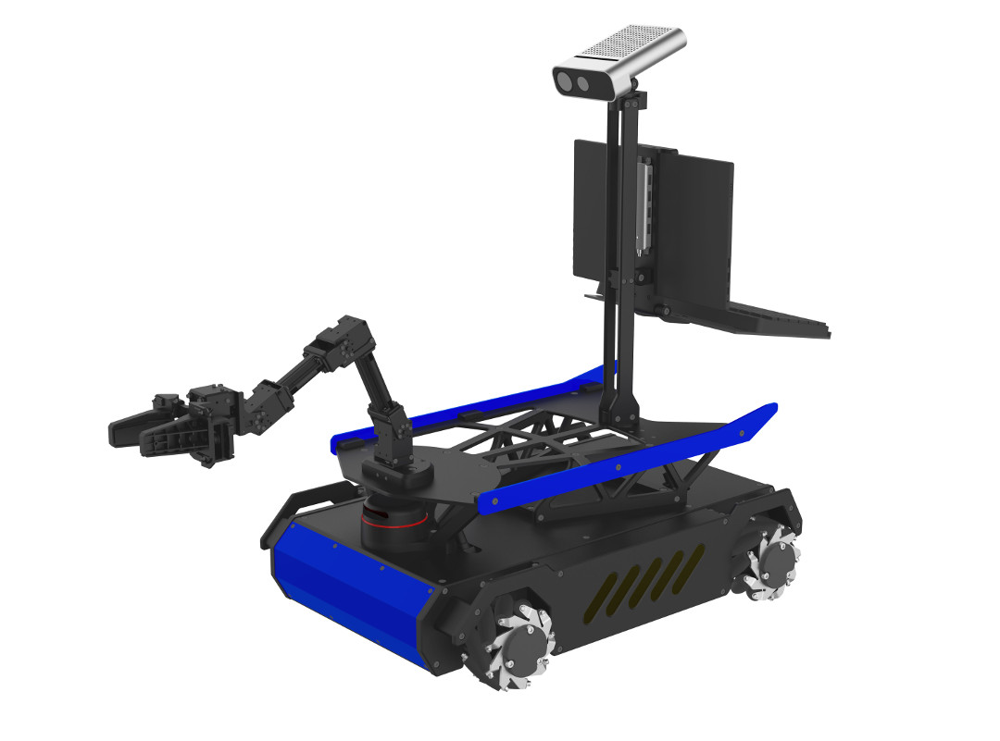
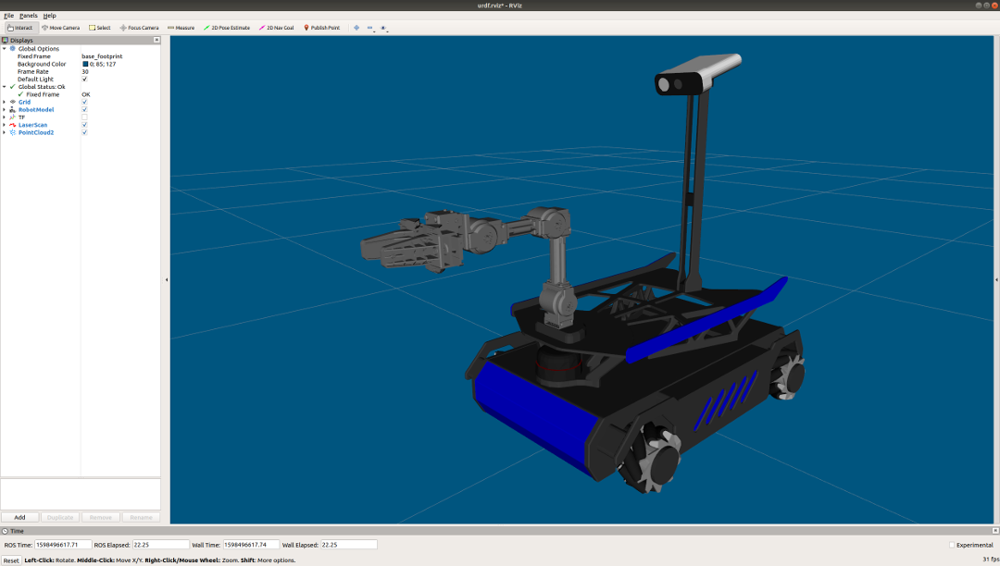
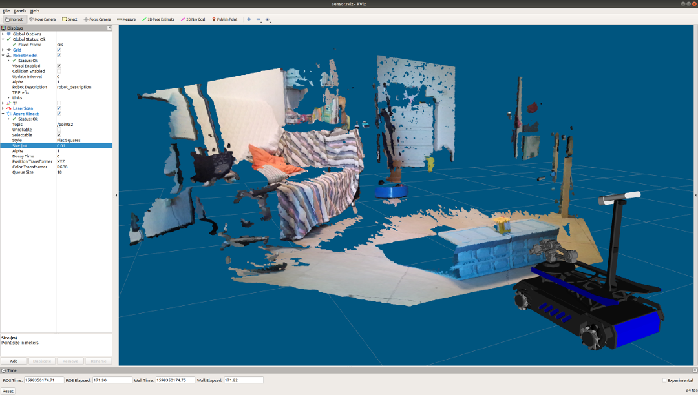
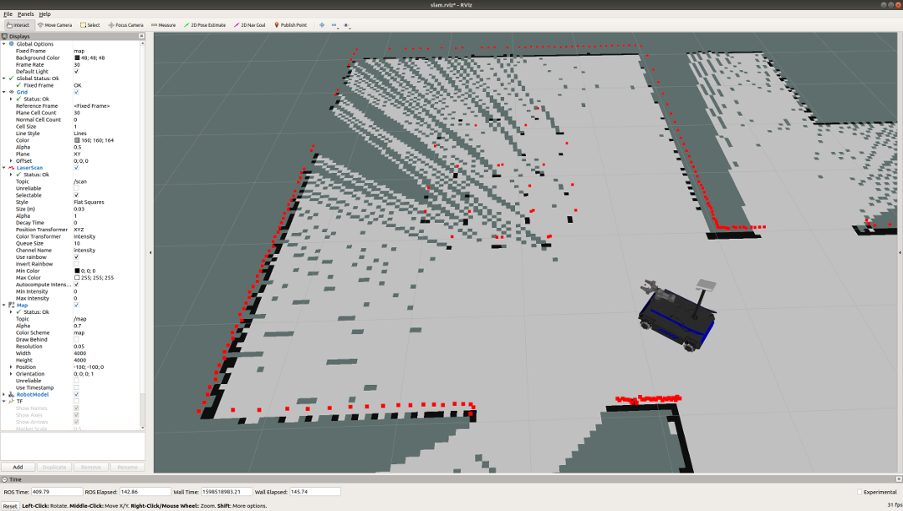
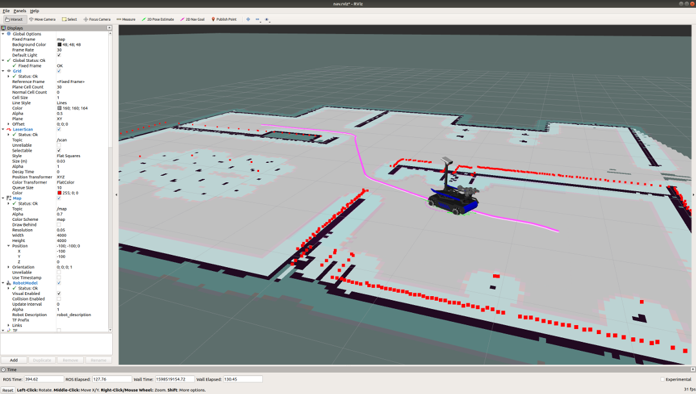
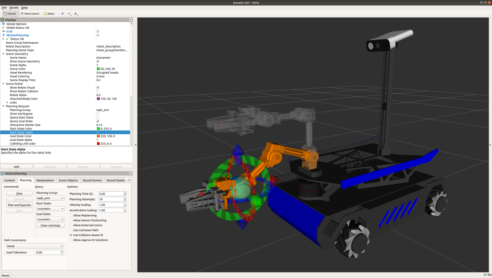
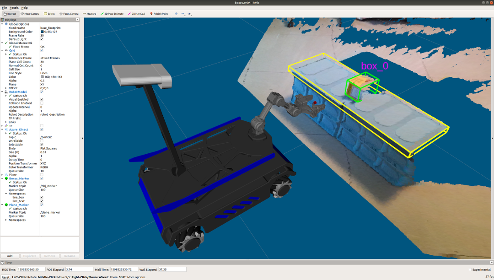
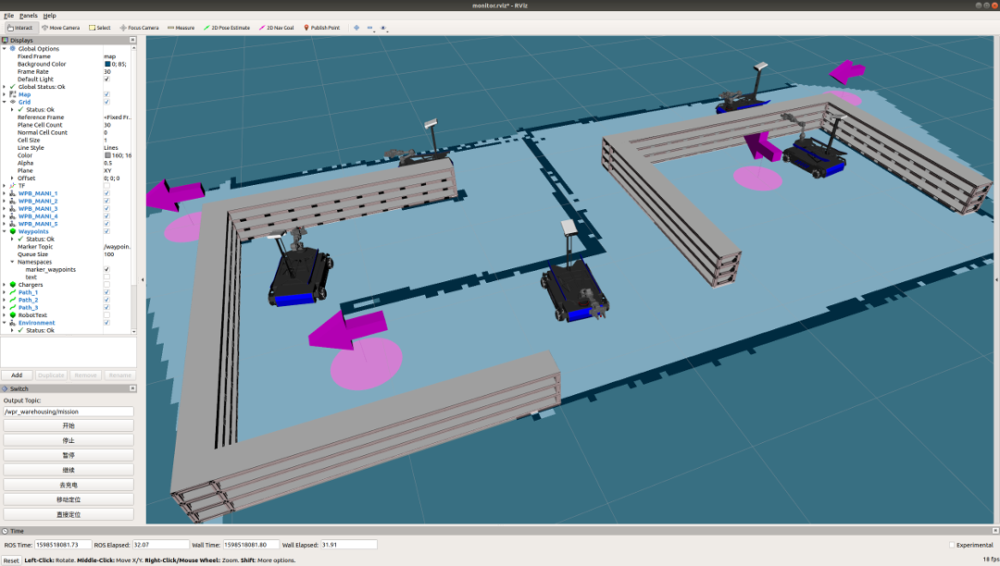
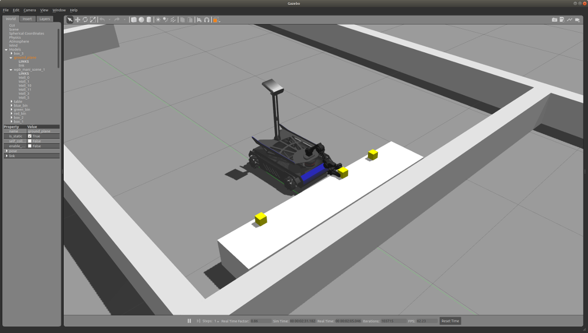

# 启智MANI机器人开放源码

## 使用步骤

1. 安装ROS.  
Melodic/Ubuntu 18.04 [安装步骤](http://wiki.ros.org/melodicic/Installation/Ubuntu)
2. 配置好开发环境. [配置方法](http://wiki.ros.org/ROS/Tutorials/InstallingandConfiguringROSEnvironment)
3. 获取源码:
```
cd ~/catkin_ws/src/
git clone https://github.com/6-robot/wpb_mani.git
```
4. 安装依赖项:  
```
cd ~/catkin_ws/src/wpb_mani/wpb_mani_bringup/scripts
./install_for_melodic.sh
```
5. 编译
```
cd ~/catkin_ws
catkin_make
```
6. 设置设备权限
```
roscd wpb_mani_bringup
cd scripts
chmod +x create_udev_rules.sh
./create_udev_rules.sh 
```

## 平台介绍
启智MANI是[北京六部工坊科技有限公司](http://www.6-robot.com)为移动抓取教学开发的一款机器人平台。其拥有麦克纳姆轮全向移动底盘、激光测距雷达、立体视觉相机、四自由度机械臂等一系列配置。机载计算单元集成384枚GPU硬件加速器，具有极强的三维图形处理和神经网络运算能力。所有实验例程基于ROS机器人操作系统，实验内容覆盖ROS的Navigation、MoveIt、OpenCV、PCL等多个子系统和函数库，可以进行完整的环境建图、定位导航、运动学规划、机器视觉和三维感知等经典技术的应用实验。除了基于硬件实体的现场实验，还特别设计了基于Gazebo的软件仿真实验，非常适合移动抓取机器人技术的教学和研究。


## 功能特性

### 1. URDF模型描述
启智MANI具备完整的URDF模型描述，可以在ROS系统里直接加载。


### 2. 三维立体视觉
启智MANI采用最新一代的TOF立体相机，探测距离达到8米，最大视角70°，适用于对室内环境的三维模型重构。


### 3. SLAM环境建图
启智MANI装备了新一代的360°激光雷达，可以实时扫描机器人周围的障碍物分布状况，借助HectorSLAM和GMapping算法，创建环境地图。


### 4. 自主定位导航
启智MANI将激光雷达扫描的距离信息与电机里程计数据进行融合，使用AMCL方法进行地图定位，结合ROS的move_base进行自主导航。


### 5. 机械臂运动学
启智MANI机器人可使用MoveIt!子系统对机械臂进行运动学正反解计算，并完成运行路径的自动规划。


### 6. 物品抓取
启智MANI搭载一台四自由度机械臂，可以在物品检测的基础上实现物品抓取功能。


### 7. 多机器人系统
启智MANI机器人可以多台实现相互配合协作。基于ROS开发的群体决策模型，拥有任务分解、效用考核、角色分配、行为同步等多个层级的系统架构，能够很好的协调多个机器人协同完成复杂任务。


### 8. GAZEBO仿真系统
启智MANI机器人的模型文件具备完整的物理惯量和传感器配置描述，可以在GAZEBO仿真环境里直接加载。附赠的源码资源中，包含多个物理仿真场景，可以脱离机器人实体，在纯软件环境中进行算法模拟。


